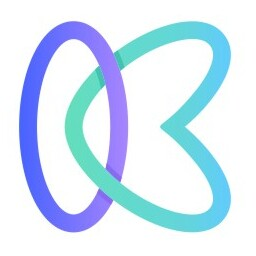

<div id="top"></div>


<!-- PROJECT LOGO -->
<br />
<div align="center">
  <a href="https://github.com/othneildrew/Best-README-Template">
    
  </a>

  <h3 align="center">Kickstart</h3>

  <p align="center">
    Everything you need to buy and sell startups.
No hassle. Total anonymity.
    <br />
    <a href="https://github.com/othneildrew/Best-README-Template"><strong>View Project »</strong></a>
    <br />
    <br />
    <a href="https://github.com/saisatwik99/kickstart/issues">Open Issue</a>
    ·
    <a href="https://github.com/saisatwik99/kickstart/issues">Report Bug</a>
    ·
    <a href="https://github.com/saisatwik/kickstart/issues">Request Feature</a>
  </p>
</div>


<!-- TABLE OF CONTENTS -->
<details>
  <summary>Table of Contents</summary>
  <ol>
    <li>
      <a href="#about-the-project">About The Project</a>
      <ul>
        <li><a href="#built-with">Built With</a></li>
      </ul>
    </li>
    <li>
      <a href="#getting-started">Getting Started</a>
      <ul>
        <li><a href="#prerequisites">Prerequisites</a></li>
        <li><a href="#installation">Installation</a></li>
      </ul>
    </li>
    <li><a href="#usage">Usage</a></li>
    <li><a href="#roadmap">Roadmap</a></li>
    <li><a href="#contributing">Contributing</a></li>
    <li><a href="#Support">Support</a></li>
  </ol>
</details>


<!-- ABOUT THE PROJECT -->
## About The Project

Join 100,000+ entrepreneurs buying and selling startups on the world’s best acquisition marketplace. Get instant access to 100,000+ trusted buyers. Big or small, get your startup acquired at the maximum price in as little as 30 days.

<p align="right">(<a href="#top">back to top</a>)</p>


### Built With

* [React.js](https://reactjs.org/)
* [Tailwindcss](https://tailwindcss.com/)
* [Nodejs](https://nodejs.org/en/)
* [Expressjs](https://expressjs.com/)
* [MongoDB](https://www.mongodb.com/)

<p align="right">(<a href="#top">back to top</a>)</p>


<!-- GETTING STARTED -->
## Getting Started

To get a local copy up and running follow these simple example steps.

### Prerequisites

This is an example of how to list things you need to use the software and how to install them.
* npm
  ```sh
  npm install npm@latest -g
  ```
* node
  ```sh
  sudo apt install nodejs
  ```

### Installation

1. Clone the repo
   ```sh
   git clone https://github.com/saisatwik99/kickstart.git
   ```
2. Change the directory
   ```sh
   cd kickstart
   ```
3. Install NPM packages
   ```sh
   npm install
   ```
4. Start the Server
   ```sh
   npm start
   ```

<p align="right">(<a href="#top">back to top</a>)</p>

<!-- CONTRIBUTING -->
## Contributing

Contributions are what make the open source community such an amazing place to learn, inspire, and create. Any contributions you make are **greatly appreciated**.

If you have a suggestion that would make this better, please fork the repo and create a pull request. You can also simply open an issue with the tag "enhancement".
Don't forget to give the project a star! Thanks again!

1. Fork the Project
2. Create your Feature Branch (`git checkout -b feature/AmazingFeature`)
3. Commit your Changes (`git commit -m 'Add some AmazingFeature'`)
4. Push to the Branch (`git push origin feature/AmazingFeature`)
5. Open a Pull Request

<p align="right">(<a href="#top">back to top</a>)</p>


<!-- SUPPORT -->
## Support
[](https://www.buymeacoffee.com/saisatwik99)

<p align="right">(<a href="#top">back to top</a>)</p>
